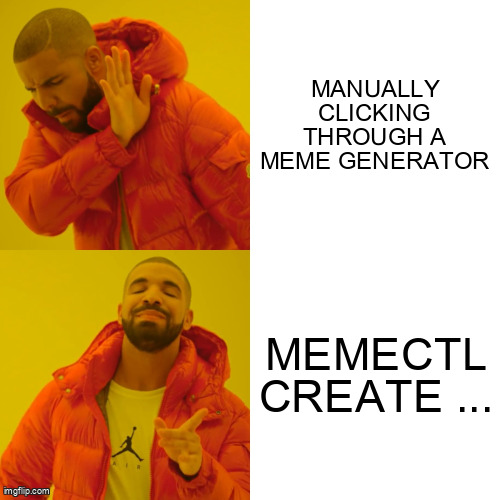

# memectl

<p align="center">
  
  <br>
  <em>Production-Grade Meme Management Tool</em>
</p>

`memectl` is a command-line interface for creating memes and other Imgflip
artifacts. It is an early project that will grow alongside Imgflip's API,
because meme operations deserve operational rigor.

`memectl` is built primarily to evaluate
[OpenSpec](https://github.com/Fission-AI/OpenSpec) and spec-driven development.

## Install

Download the `.tar.gz` archive for your operating system and architecture from
the [GitHub Releases](https://github.com/jasonwashburn/memectl/releases) page.
Released archives support macOS and Linux on `amd64` and `arm64`.

Extract the archive, then move `memectl` to your preferred directory on
`PATH`. Replace the placeholders with the filename you downloaded and the
directory you use for executables:

```sh
tar -xzf memectl_VERSION_OS_ARCH.tar.gz
mv memectl /path/to/bin/
```

Verify the installation:

```sh
memectl --version
```

## Usage

List available Imgflip meme templates. This command does not require Imgflip
credentials:

```sh
memectl get templates
```

Include each template's direct image URL with wide output to visually preview it:

```sh
memectl get templates --output wide
```

Create a captioned meme from a template. Set your Imgflip account credentials
first; they are required only for creation:

```sh
export IMGFLIP_USERNAME="your-imgflip-username"
export IMGFLIP_PASSWORD="your-imgflip-password"
memectl create meme 181913649 --text "Writing memes manually" --text "Using memectl"
```

Use `--text` once for each template text box, in the order Imgflip should
apply them. On success, `memectl` prints the hosted image URL and its Imgflip
page URL. Hosted images are publicly accessible on the internet.

## Contributing

See [CONTRIBUTING.md](CONTRIBUTING.md) for source setup, local checks, and
release snapshots.
